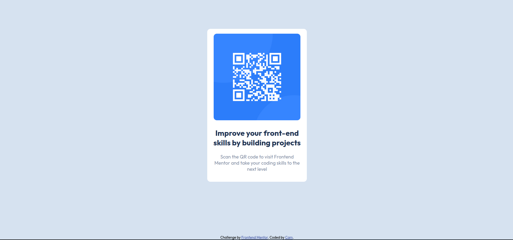

# Frontend Mentor QR Code Generator Project

This is a small project I created for the Frontend Mentor platform, focusing on practicing HTML and CSS. The project involves building a QR code generator based on the given design from Frontend Mentor.

## Project Details

- **Author**: [Cam](https://github.com/CMarchandon)
- **Live Preview**: [QR Code Generator](https://cmarchandon.github.io/frontend-mentor-qrcode/)

## Preview

Feel free to explore the live preview of the QR Code Generator to see the outcome of this small project.

Please note that this project was completed based on the design and requirements provided by Frontend Mentor. It serves as a learning experience and practice opportunity for frontend development skills. 
